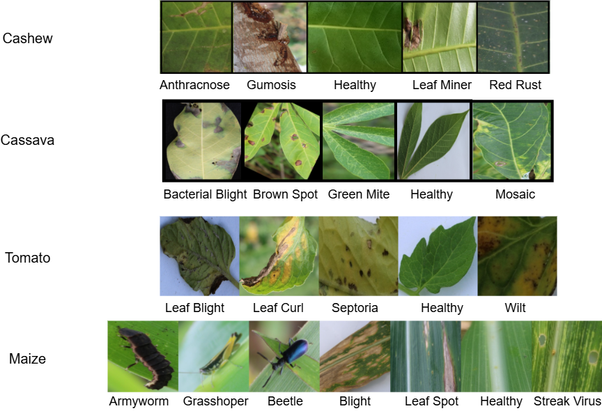
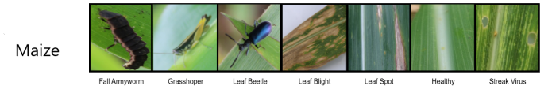
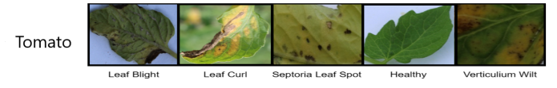

# Lightweight Attention-Enhanced CNN for Multi-Class Plant Disease Classification

## Overview

This repository contains the complete implementation for the research paper:

**"Lightweight Attention-Enhanced Convolutional Learning Framework for Multi-Class Plant Disease Classification Across Diverse Crops"**

The proposed framework integrates:

* **MobileNetV2+Channel Attention**
* **MobileNetV2+Transformer Attention 1**
* **MobileNetV2+Transformer Attention 2**
* **(Mob+Den)+Channel Attention**
* **(Mob+Den)+Transformer Attention 1**
* **(Mob+Den)+Transformer Attention 2**
* **Channel attention module**

for efficient and robust multi-class plant disease classification under resource-constrained agricultural environments.

The framework is designed to capture:

* local disease texture patterns
* global contextual relationships
* channel-wise disease relevance

while maintaining low computational complexity.

---

## Dataset Description

The dataset used in this study contains leaf images from four crop species:

* cassava
* cashew
* maize
* tomato

Each crop contains multiple healthy and diseased classes.

## Overview

The CCMT dataset is a multi-crop plant disease image dataset developed for crop disease classification and deep learning-based agricultural research. It contains leaf images collected from four major crop species: cassava, cashew, maize, and tomato. The dataset is designed to support multi-class and multi-crop disease recognition tasks and is widely used for evaluating transfer learning models, lightweight convolutional neural networks, hybrid deep learning frameworks, and attention-based classification methods.

The dataset includes both healthy and diseased leaf categories, allowing models to learn disease discrimination across visually similar classes and diverse crop species.

---

## Crop-wise Disease Classes

### 1. Cassava

Cassava classes included in the dataset represent major foliar diseases commonly affecting cassava production.

#### Disease Classes

* Cassava Bacterial Blight (CBB)
* Cassava Brown Streak Disease (CBSD)
* Cassava Green Mottle (CGM)
* Cassava Mosaic Disease (CMD)
* Healthy Cassava

#### Disease Characteristics

* Cassava Bacterial Blight shows angular brown lesions and tissue necrosis.
* Cassava Brown Streak Disease presents chlorotic yellow vein-associated patterns.
* Cassava Green Mottle exhibits irregular green-yellow mottling.
* Cassava Mosaic Disease shows mosaic chlorosis and leaf deformation.

---

### 2. Cashew

Cashew classes represent major fungal and pest-related diseases affecting leaf health.

#### Disease Classes

* Anthracnose
* Gummosis
* Leaf Miner
* Red Rust
* Healthy Cashew

#### Disease Characteristics

* Anthracnose causes dark necrotic lesions with irregular boundaries.
* Gummosis affects tissue integrity and leaf health.
* Leaf Miner creates visible internal feeding tunnels.
* Red Rust appears as orange-red fungal patches on the leaf surface.

---

### 3. Maize

Maize classes include important foliar diseases that affect cereal crop productivity.

#### Disease Classes

* Fall Armyworm
* Grasshoper
* Leaf Spot
* Leaf Blight
* Healthy Maize
* Leaf Beetle
* Streak Virus

#### Disease Characteristics

* Common Rust produces reddish-brown pustules.
* Gray Leaf Spot forms elongated rectangular lesions.
* Northern Leaf Blight creates long cigar-shaped necrotic lesions.

---

### 4. Tomato

Tomato contributes the largest number of disease classes in the dataset.

#### Disease Classes

* Late Blight
* Septoria Leaf Spot
* Verticulium Wilt
* Leaf Curl 
* Healthy Tomato

#### Disease Characteristics

* Late Blight causes water-soaked irregular lesions.
* Verticillium Wilt is a fungal disease that causes leaf yellowing, wilting, and drying by blocking water.
* Septoria Leaf Spot creates small circular necrotic spots.
* Yellow Leaf Curl Virus causes upward curling and yellowing.

---

## Dataset Characteristics

* Multi-crop disease classification dataset
* Healthy and diseased leaf categories
* Suitable for transfer learning and attention-based deep learning models
* Supports lightweight CNN benchmarking
* Useful for multi-class agricultural image classification

---

## Research Applications

The dataset is suitable for:

* Convolutional Neural Networks (CNN)
* Transfer Learning Models
* Lightweight Mobile Architectures
* Hybrid Attention Networks
* Transformer-assisted Disease Classification
* Multi-crop Generalization Studies

---

## Recommended Experimental Usage

Typical experimental split:

* Training: 70% or 80%
* Validation: 10% or 15%
* Testing: 10% or 15%

Input image size commonly used:

* 224 × 224 pixels

Common preprocessing steps:

* Resizing
* Normalization
* Data augmentation
* Noise robustness testing

---

### Dataset Directory Structure

dataset/
├── train/
│ ├── class_1/
│ ├── class_2/
│ ├── ...
├── validation/
│ ├── class_1/
│ ├── class_2/
│ ├── ...
### CCMT Dataset Download Link 
https://data.mendeley.com/datasets/bwh3zbpkpv/1

### Image Settings

* Image size: **224 × 224**
* Color mode: **RGB**
* File format: **JPG / PNG**

### Dataset Split

* Training: 80%
* Validation: 10%
* Testing: 10%

---

## Environment Requirements

### Software

* Python 3.10 or above
* TensorFlow 2.x
* NumPy
* Matplotlib
* scikit-learn
* Pandas
* OpenCV

### Hardware Used

* GPU: NVIDIA GPU recommended
* RAM: Minimum 8 GB

---

## Installation

Clone repository:

git clone https://github.com/anand1982/MV2TA2Net-MDC4Net-TA-2.git

(https://github.com/anand1982/MV2TA2Net-MDC4Net-TA-2.git)

Move to project folder:

cd yourrepository

Install dependencies:

pip install -r requirements.txt

---

## Requirements File

Example requirements:

tensorflow
numpy
matplotlib
scikit-learn
pandas
opencv-python

---

## Training Procedure

Run training script:

python train.py

### Default Training Parameters

* Epochs: 50
* Batch size: 32
* Learning rate: 0.0001
* Optimizer: Adam
* Loss function: categorical crossentropy

### Reproducibility Settings

Random seeds are fixed:

* NumPy seed = 42
* TensorFlow seed = 42

This ensures reproducibility of reported results.

---

## Testing Procedure

To test on unseen images:

python test.py --image sample_leaf.jpg

---

## Model Architecture

The proposed framework consists of:

### Backbone

* MobileNetV2 pretrained feature extractor

### Attention Modules

* Self-attention for global spatial dependency learning
* Channel attention for feature recalibration

### Classification Head

* Global Average Pooling
* Dense layer
* Softmax output

---

## Output Generated

After training, the following outputs are generated:

outputs/
├── saved_model/
├── accuracy_graph.png
├── loss_graph.png
├── confusion_matrix.png
├── classification_report.txt

---

## Performance Metrics

The following evaluation metrics are computed:

* Accuracy
* Precision
* Recall
* F1-score
* Confusion Matrix

---

## Reproducing Manuscript Results

To reproduce manuscript experiments:

1. Place dataset in dataset/ folder
2. Run train.py
3. Run evaluation.py
4. Compare outputs with manuscript tables

All hyperparameters are identical to manuscript settings.

---

## File Description

train.py → training script
test.py → testing script
evaluation.py → metric calculation
model.py → architecture definition

---

## Saved Model

Trained model is stored at:

saved_model/model.h5

Load model:

from tensorflow.keras.models import load_model
model = load_model('saved_model/model.h5')

---

## Citation

If you use this code, please cite:

Author Name, "Lightweight Attention-Enhanced Convolutional Learning Framework for Multi-Class Plant Disease Classification Across Diverse Crops", submitted to Pattern Analysis and Applications.

---

For questions related to implementation or reproducibility, please contact the corresponding author through manuscript email.
